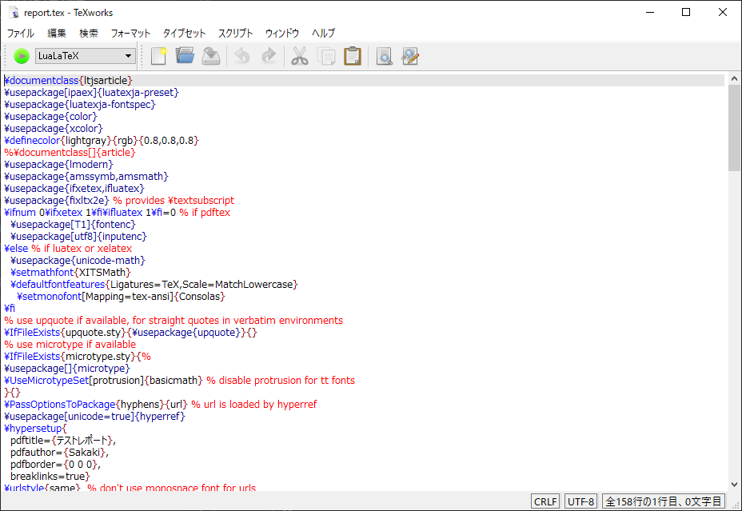

# Markdown to PDF (LaTeX)

Markdownでレポートを書きたくて試行錯誤した結果、とりあえず落ち着いた環境をまとめておきます。

プログラムのコードをある程度綺麗に載せたいという方針で設定を行いました。

サンプルとして、[report.md](./report.md)を[report.pdf](./report.pdf)に変換しています。

ただし、私はLaTeXに関しては知識が乏しいため、必要なら[custom.latex](./custom.latex)を変更して使ってください（pull reqやfork大歓迎です）。

## 環境

* Windows 10 Home 1809 64bit
* TeXworks Editor 0.6.2 (2017/04/30)
* Pandoc 2.3.1
* お好みのMarkdownエディタ

TeXのパッケージは手動で入れても良いですが、いろいろ入ってるTeXworksがおススメです。

## Pandocでの変換

テンプレートとして[custom.latex](./custom.latex)ファイルが必要です。[report.md](./report.md)と同じディレクトリに配置されているか確認してください。

```powershell
pandoc --mathml --listings --template=custom -V monofont="Consolas" .\report.md -o .\report.tex
```

## TeXworksでの変換

出力されたreport.texを読み込ませてタイプセットの方法（実行ボタンの右側の選択フォーム）を「LuaLaTeX」に変更してください。

その後実行ボタンを押してしばらく待つと[report.pdf](./report.pdf)が生成され、プレビューが表示されます。



## 気を付ける事

* monofontとして渡すフォントは[monospaceな物](https://en.wikipedia.org/wiki/List_of_monospaced_typefaces)でないとエラーが起きます（当然と言えば当然ですが・・・）
* 表の枠線は日本語フォントの関係でたまにバグります。ダメな時は明らかにサイズが間違っている項目名の左右とかに全角スペースを入れてあげてください([report.md](./report.md)参照)
