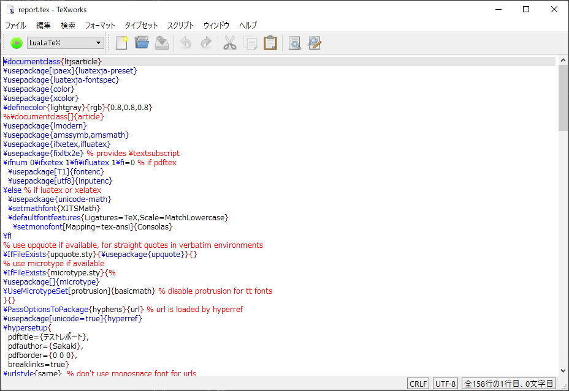

% テストレポート
% Sakaki
% 2018/11/13

# 1. プログラム

プログラムはこんな感じになります。

```python
class Device:
    type_id = TypeId.LookupByName("ns3::PacketSocketFactory")

    def __init__(self, address):
        self.address_send = self.address_receive = address
        self.socket_send = self.socket_receive = None
    
    def prepare(self, node, callback):
        self.socket_send = PacketSocket.CreateSocket(node, self.type_id)
        self.socket_send.Bind(self.address_send)
        self.socket_send.Connect(self.address_send)

        self.socket_receive = PacketSocket.CreateSocket(node, self.type_id)
        self.socket_receive.Bind(self.address_receive)
        self.socket_receive.Connect(self.address_receive)
        self.socket_receive.SetRecvCallback(callback)
    
    def send_packet(self, packet):
        return self.socket_send.Send(packet, 0)
```

# 2. 数式

数式はこんな感じになります。

$$\mathrm{TimesIn}(x) = \frac{\Sigma_{i=1}^{c-(x-1)}N_{i}}{T_{tw}N_x},\, \mathrm{CacheWeight}(x) = \frac{x}{c}\hspace{2cm}(1)$$

$$\mathrm{ProbCache}(x) = \mathrm{TimesIn}(x) \times \mathrm{CacheWeight}(x)\hspace{2cm}(2)$$

# 3. 図表

表はこんな感じになります。

Table: テスト

|スペクトル線|次数|　$\theta_m$　|$N / \,\mathrm{mm^{-1}}$|$\Delta N / \,\mathrm{mm^{-1}}$|
|:-:|:-:|:-:|:-:|:-:|
|$D_1$|1|$20^{\circ}\,43'\,05''$|$599.99$|$0.46$|
|$D_1$|2|$45^{\circ}\,05'$|$599.92$|$0.17$|
|$D_2$|1|$20^{\circ}\,56'$|$600.36$|$0.46$|
|$D_2$|2|$45^{\circ}\,00'$|$600.53$|$0.17$|

図はいろいろとずれるので最後にまとめて置いた方が良いです。

また、図表番号は順番に付いていくようですが、文中で動的に参照する方法があるかはちょっと分かりません。R markdownだと[このサイト](https://rmarkdown.rstudio.com/authoring_basics.html)に書いてある感じでいけるらしいですが・・・

{width=10cm}
